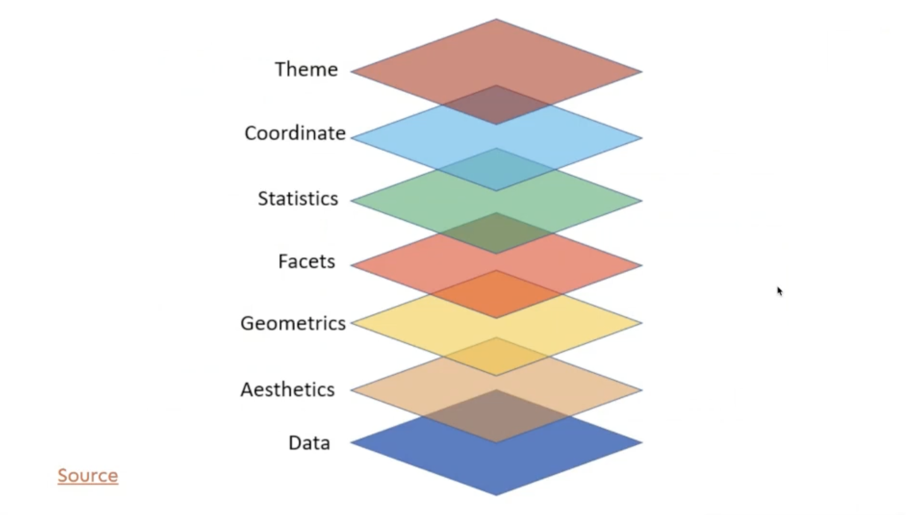

This is a note taking page I used while watching the R For Beginners Online Training Videos: 

https://koliajay.netlify.app/talk/rforbeginners/

# Session 1: 
## Direct calculation on R (R as a Big calc)
```{r}
1
1 + 1
34/40
5 < 4
16 == 16
```

## Plot using R
```{r}
plot(1:100)
```

## R functions
A function, in a programming environment, is a set of instructions. A programmer builds a function to avoid repeating the same task, or reduce complexity. 
```{r}
# Rounding
round(9.1615, 2)
```

```{r}
# Square Root
sqrt(9)
```

```{r}
# Sequence function: 
# Create a sequence from 10 to 30, add each number by 5
seq.int(10, 30, 5)
```

## Packages
```{r}
# Download the package
# install.packages("tidyverse")
# Use the package
# Rember to update packages from time to time
library(tidyverse)
# Install more than one package at the same time
# install.packages(c("ggplot2", "palmerpenguins"))
```

## Objects
A name that you can use to call up stored data
```{r}
# Create and call an object
# A name cannot start with a number and no special symbols
# Also avoid caps and space
# Use dash or underscore instead
salary <- c(20, 30, 40, 50, -60)
salary
```
## Combine created objects
```{r}
# Create more objects
age <- c(34, 54, 23, 65, 2)
books <- c(4, 0, 3, 24, 5)
name <- c("Ram", "John", "Ali", "Pretti", "Rani")
place <- c("ny", "ber", "dhl", "tko", "lon")
```

```{r}
# Create a data object with data.frame()
social <- data.frame(age, books, name, place, salary)
social
```

```{r}
# Save the dataset as a csv file
write.csv(social, "temp_folder/social.csv")
```

## Get documentation of packages
```{r}
?ggplot
```


# Session 2: Dynamic Documents using R Markdown
3 important parts of R Markdown

1. YAML: Another markup language, marked by the three dash, states the titles, author, etc.

1. Code chunk

1. Text

## Styles
### Hash
The hash is for title, and more hash you put, the smaller the heading will be

### Number List
Just put 1. in front of the text, and numbers will automatically transform into order

1. One

1. Two

1. Three

### Bullet Point
Single hash will transform into bullet points

- See

- It 

- Works!

### Text styles
- *Single Star for italic text*

- **Double Stars for bold**

- ***Triple Stars for italic and bold***

- Dollar sign for equations

- $E=MC^2$

- Double Dollar sign to put it on the left side

$$a=(b+c)/2$$

### Others
Use Latex-Project for more complex markdown formats

## Code Chunk
Hot key: Command + option + i
```{r}
# this is a code chunk
plot(1:10)
```

You can add a name for the code chunk
```{r This is a chunk name}
# Example
```

You can also have options on the code chunk
```{r This is to show options, out.width="50%"}
# Example
plot(1:5)
```

Use the code echo=false in the code chunk {r} bracket to hide the code
```{r echo example, echo=FALSE}
plot(1:100)
```

## Add Image
```{r Add Cat Memes from internet, out.width="50%"}
# you can give a link to internet
knitr::include_graphics("https://i.imgur.com/LF5ZDE7.jpg")
```

```{r Add cats meme from computer}
# or computer

```

### Add Tables
```{r}
library("kableExtra")
library("palmerpenguins")
# kableExtra is for table
# palmerpenguins contains a dataset for demonstration

penguins %>%
  head() %>%
  kbl() %>%
  kable_styling() 
# head is to show limited rows of data
# kbl for the table
# kable_styling for style
  
```

# Session 3: Data Visualisation using ggplot2
## Common variables in R
- int: stands for integers, e.g. 1, 40, 42, 50
- dbl: stands for doubles, e.g. 7.45, 11.625, 1234.5
- chr: stands for character vectors, or strings like names
- dttm: date-times
- date
- lgl: logical, vectors that only contain true or false
- fct: stands for factors, which R uses to represent categorical variables with fixed possible values (e.g. 7 continents)

## Overview of data
```{r}
#Install library
library(tidyverse)
```

### Glimpse of data
```{r}
# Glimpse
# Row represent sample size, columns represent variables
glimpse(penguins)
```
### Summary
```{r}
# Summarise each variables
summary(penguins)
```
### How to import data
```{r}
# library
library(readr)
# import the dataset and save it as soc
soc <- read_csv("sample_data_set.csv")
# call the dataset
soc
# it can also be done on environment session
```

## ggplot2 basic
gg stands for grammar of graphics

### Layer of data
```{r layer of data, echo=FALSE}

```
- Aesthetics: how would it look like, in terms of what will be on y axis and x axis? What valuables will be used?

### Key components of ggplots2
1. data
2. aesthetic mapping
3. at least one layer of geom function
```{r}
# data: call data
# mapping: aesthetic mapping
# geom_bar: bar as geom function
ggplot(data = penguins, mapping = aes(x = species)) + geom_bar()
# another example
ggplot(data = penguins, aes(x = island)) + geom_bar()
```

### How to export plots to your computer
```{r}
ggplot(data = penguins, aes(x = island)) + geom_bar()
ggsave("peng-species.pdf") #also try jpg/jpeg/png
```

### Add colors to bar
```{r}
ggplot(data = penguins, aes(x = island)) + 
  geom_bar(fill = "blue")
# multiple color
# number of color should = number of factors
ggplot(data = penguins, aes(x = island)) + 
  geom_bar(fill = c("orange", "white", "green"))

```

#### Add color using palette
```{r ColorPalette, fig.height = 15}
# load packages
library(ggplot2)
library(RColorBrewer)
library(wesanderson)
# Show all options from RColorBrewer
display.brewer.all()
```

```{r}
# Using RColorBrewer
ggplot(data = penguins, aes(x = island, 
# change                            
                            fill = island)) + 
  geom_bar() + 
# change 2  
    scale_fill_brewer(palette = "Dark2")
```

### How to remove legends or change its position
```{r}
ggplot(data = penguins, aes(x = island, 
                            fill = island)) + 
  geom_bar() + 
    scale_fill_brewer(palette = "Dark2") +
# change
theme(legend.position = "none") # top/bottom/left/right/none
```

### How to plot title and and axis titles?
```{r}
ggplot(data = penguins, aes(x = island, 
                            fill = island)) + 
  geom_bar() + 
    scale_fill_brewer(palette = "Dark2") +
  theme(legend.position = "none") +
# change
  labs(
    title = "Species of palmer penguins", 
    subtitle = "This data is about penguins", 
    x = "island", 
    y = "Frequency"
  )
```

### How to control size of text
```{r}
ggplot(data = penguins, aes(x = island, 
                            fill = island)) + 
  geom_bar() + 
    scale_fill_brewer(palette = "Dark2") +
  theme(legend.position = "none", 
# change below        
        text = element_text(size = 20)) +
# change above
  labs(
    title = "Species of palmer penguins", 
    subtitle = "This data is about penguins", 
    x = "island", 
    y = "Frequency"
  )
```

## More ggplot
### plot 2 numberic variables
```{r}
ggplot(data = penguins, 
       mapping = aes(x = bill_length_mm, 
                     y = bill_depth_mm, 
                     color = species)) + 
  geom_point() + 
  scale_fill_brewer(palette = "Dark2") + 
  theme(legend.position = "bottom", 
        text = element_text(size = 20)) + 
  labs(
    title = "This is a title", 
    x = "Bill Length (mm)", 
    y = "Bill Depth (mm)"
  )
  
```

### Add themes to ggplot
```{r}
ggplot(data = penguins, 
       mapping = aes(x = bill_length_mm, 
                     y = bill_depth_mm, 
                     color = species)) + 
  geom_point() + 
  scale_fill_brewer(palette = "Dark2") + 
  theme(legend.position = "bottom", 
        text = element_text(size = 20)) + 
  labs(
    title = "This is a title", 
    x = "Bill Length (mm)", 
    y = "Bill Depth (mm)"
  ) + 
# Change  
  theme_bw()
```

### Add regression to plot
```{r}
ggplot(data = penguins, 
       mapping = aes(x = bill_length_mm, 
                     y = bill_depth_mm, 
                     color = species)) + 
  geom_point() + 
  scale_fill_brewer(palette = "Dark2") + 
  theme(legend.position = "bottom", 
        text = element_text(size = 20)) + 
  labs(
    title = "This is a title", 
    x = "Bill Length (mm)", 
    y = "Bill Depth (mm)"
  ) + 
  theme_bw() + 
# change  
  geom_smooth()
```

# Session 4 Data Wrangling with dplyr
Data wrangling means "Data exploration and manipulation".
- dplyr: grammar of data manipulation
- important functions: 

1. filter()
1. select()
1. mutate()
1. arrange()
1. summarise()

```{r}
library(palmerpenguins)
library(dplyr)
```

### filter(): pick only Gentoo penguins

```{r}
penguins %>% 
  filter(species == 'Gentoo')
```
```{r}
penguins %>% 
  filter(species == 'Gentoo') %>% 
  summary() %>% 
  kableExtra::kable() %>% 
  kable_styling()
```

### More filter(): 
#### 1
```{r}
penguins %>% 
  filter(bill_length_mm > '43')
```
#### 2
```{r}
penguins %>% 
  filter(species == 'Gentoo', 
         bill_length_mm > '55')
```

### Export data file to computer
```{r}
penguins %>% 
  filter(species == 'Gentoo') %>% 
  write.csv('gentoo-penguins.csv')
# a new csv file is saved into the project folder
```

### Pipe %>% 
- control + shift + m
- sequencing multiple operations

### Comparison: Relational Operators
- x > y
- x < y
- x >= y
- x <= y
- x == y (equal)
- x != y (not equal)

### How to have only top or bottom rows from data?
```{r}
penguins %>% 
  filter(bill_length_mm > '43') %>% 
# head to only show first 6 rows
  head()
```

```{r}
penguins %>% 
  filter(bill_length_mm > '43') %>% 
# tail to only show lowest 6 rows  
# use tail(number) [e.g. tail(3)] to restrict the number of rows shown
  tail()
```

```{r}
penguins %>% 
  filter(species == "Chinstrap", 
         bill_length_mm > 45, 
         body_mass_g > 4000) 
```

### select()
```{r}
penguins %>% 
  select(species)
```

```{r}
# Only variables from species to bill_length_mm
penguins %>% 
  select(species : bill_length_mm)
```

```{r}
# You can also use the order of range to select variables
penguins %>% 
  select(4:8)
```

```{r}
# For specific variables
penguins %>% 
  select(bill_depth_mm, body_mass_g)
```

```{r}
# Select except some specific variables using -c()
penguins %>% 
  select(-c(bill_depth_mm, year))
```

### mutate(): Add new variables that are functions of existing variables

```{r}
# Covert penguin body mass from grams to kilograms
penguins %>% 
  mutate(body_mass_kg = body_mass_g / 1000)
```
```{r}
# If you just want the 2 related variables
penguins %>% 
  select(body_mass_g) %>% 
  mutate(body_mass_kg = body_mass_g / 1000)
```

```{r}
# Add 2 variables at the same time
penguins %>% 
  mutate(body_mass_kg = body_mass_g / 1000, 
         bill = bill_length_mm * bill_depth_mm)
```

```{r}
# Show only the new variables
penguins %>% 
  mutate(body_mass_kg = body_mass_g / 1000, 
         bill = bill_length_mm * bill_depth_mm) %>% 
  select(body_mass_kg, 
         bill)
```

### arrange(): Changes the order of the rows
```{r}
# Arrange the data by ascending order of bill length
penguins %>% 
  arrange(bill_length_mm)
```

```{r}
# In desc order
penguins %>% 
  arrange(desc(bill_length_mm))
```

```{r}
# Non-numeric variables work too
penguins %>% 
  arrange(species)
```

### summarise(): choose rows based on column values
```{r}
# Mean bill length of all penguins
penguins %>% 
# drop_na to avoid n/a cells because they do not work with statistics calculations  
  drop_na %>% 
  summarise(mean_bill_length_mm = mean(bill_length_mm))
```

```{r}
# Find species-wise mean bill length of all penguins with group_by()
penguins %>% 
  drop_na %>% 
  group_by(species) %>% 
  summarise(mean_bill_length_mm = mean(bill_length_mm))
```

```{r}
# Find species-wise mean bill length of all penguins and total number of penguins in each species
penguins %>% 
  drop_na %>% 
  group_by(species) %>% 
  summarise(mean_bill_length_mm = mean(bill_length_mm), 
# n() calculate how many elements are in the variable        
# Sometimes you should use count() instead
# n() only work for specific group size (e.g. within mutate() or summarise())
            n = n())
```
